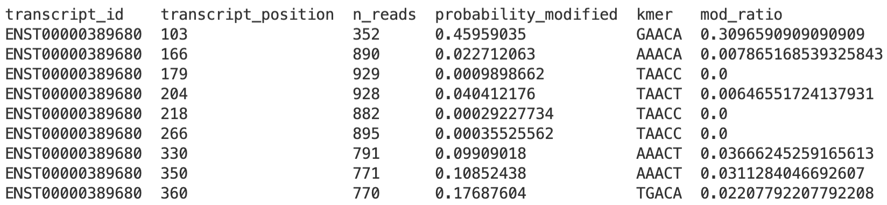

# **Identification of m6A with the SG-NEx samples** 

In this tutorial, we will perform m6A identification on the SG-NEx sample. We will use the Nanopore direct RNA-sequencing data of the A549 cell line from the SG-NEx project for this analysis. The A549 cell line was extracted from the lung tissues of a patient with lung cancer. A Python package known as **m6Anet**, will be used to determine m6A modification site in the cell line. <br>
**Note: This tutorial may take 15 minutes to complete.** 

## **Content**

- [Installation](#installation)
- [Data Access and Preparation](#data-access-and-preparation)
- [Running m6Anet](#running-m6anet)
- [Reference](#reference)

## **Installation**

m6Anet requires Python 3.8 (or later) to run. It can be installed through PyPI using the following command. Note: This command requires pip3 to be installed. 


```bash
pip install m6anet
```

Alternatively, it can be installed from our GitHub repository.


```bash
git clone https://github.com/GoekeLab/m6anet.git
cd m6anet
python setup.py install
cd ..  # return to the working directory 
```

## **Data Access and Preparation**

For this tutorial, we will use the data from the A549_directRNA_replicate6_run1 sample. The required data include:

- feature values of the A549 sample (json file), 
- indexes of the feature values file (index file),
- number of reads for each DRACH position (readcount file).

### **Download data for m6Anet**
The data files can be downloaded from the [SG-NEx AWS S3 bucket](http://sg-nex-data.s3-website-ap-southeast-1.amazonaws.com/). Please refer to this [page](https://github.com/GoekeLab/sg-nex-data/blob/update-docs-aws/docs/AWS_data_access_tutorial.md) for a comprehensive tutorial to access the SG-NEx dataset.

To begin, we will create a directory to store the required files.
```bash
# create a directory to store the processed data for this sample
mkdir A549_directRNA_replicate6_run1 
```

Then, we will access the S3 bucket to download the data into the created directory. There are two methods to download the data. 
<br>

#### **Method One(Recommended):** 
Note: The command requires you to have [AWS CLI](https://aws.amazon.com/cli/) installed.
```bash
# To download the processed data
aws s3 sync --no-sign-request s3://sg-nex-data/data/processed_data/m6Anet/SGNex_A549_directRNA_replicate6_run1 ./A549_directRNA_replicate6_run1
# The directory should now contain three files. They are the json, index and readcount files.
```
Alternatively, we can use the URL to the S3 bucket to download the processed data. 
<br>

#### **Method Two:**
```bash
cd A549_directRNA_replicate6_run1 
 
# To download the json file
wget https://sg-nex-data.s3.ap-southeast-1.amazonaws.com/data/processed_data/m6Anet/SGNex_A549_directRNA_replicate6_run1/data.json  

# To download the index file
wget https://sg-nex-data.s3.ap-southeast-1.amazonaws.com/data/processed_data/m6Anet/SGNex_A549_directRNA_replicate6_run1/data.index

# To download the readcount file
wget https://sg-nex-data.s3.ap-southeast-1.amazonaws.com/data/processed_data/m6Anet/SGNex_A549_directRNA_replicate6_run1/data.readcount

# Exit the A549 directory to return to our working directory
cd ..
```


You may refer to this [page](https://github.com/GoekeLab/sg-nex-data/blob/update-docs-aws/docs/samples_with_RNAmod_data.tsv) for the list of URLs to access the processed data for m6Anet from different samples. 

## **Running m6Anet**

Now that all the required files are ready, we can proceed to run the m6Anet analysis. 


```bash
# Run m6Anet
m6anet-run_inference --input_dir ./A549_directRNA_replicate6_run1 --out_dir ./A549_directRNA_replicate6_run1 --infer_mod_rate --n_processes 4
```
**Note: You can reduce the "n_processes" if you have lesser processes available in your machine. However, lowering the "n_processes" may increase the running time.**


m6Anet returns a compressed csv file `(data.result.csv.gz)` that contains the modification probability and stoichiometry for each candidate site. The first few lines of the file are shown below.


<p align="center">
    
</p>

Please refer to the [m6Anet documentation](https://m6anet.readthedocs.io/en/latest/quickstart.html) for more information regarding the output file. 
<br>


m6Anet also allows the pooling of replicates. It can be done by providing the file path to each replicate's folder containing the json, index and readcount files. 

Example:
```
m6anet-run_inference --input_dir ./replicate1 ./replicate2 ./replicate3 --out_dir ./result --infer_mod_rate --n_processes 4
```
<br>

#### **NOTE: This is a short tutorial to demonstrate the usage of m6Anet on the SG-NEx data. Please refer to the [m6Anet documentation](https://m6anet.readthedocs.io/en/latest/quickstart.html) for the complete workflow to identify m6A modification.** 
<br>

### **Access to the required files for the complete workflow** 

If you wish to run the complete workflow of m6Anet, you can access all the required files (fast5, fastq and bam files) from the [SG-NEx S3 bucket](https://github.com/GoekeLab/sg-nex-data/blob/update-docs-aws/docs/samples.tsv). 


```bash
# Note: Please make sure to replace the "sample_alias" with your sample name

# To download the fast5 file
aws s3 sync --no-sign-request s3://sg-nex-data/data/sequencing_data_ont/fast5/<sample_alias> ./

# To download the fastq file
aws s3 sync --no-sign-request s3://sg-nex-data/data/sequencing_data_ont/fastq/<sample_alias> ./

# To download the bam file
aws s3 sync --no-sign-request s3://sg-nex-data/data/sequencing_data_ont/bam/transcriptome/<sample_alias> ./
```

Meanwhile, you can also access the transcriptome fasta files and the gtf file (annotation file) using the following command.

```bash 
# To download the transcriptome fasta file
aws s3 sync --no-sign-request s3://sg-nex-data/data/annotations/transcriptome_fasta ./ --exclude hg38*

# To download the gtf file
aws s3 cp --no-sign-request s3://sg-nex-data/data/annotations/gtf_file/Homo_sapiens.GRCh38.91.gtf ./
```
Alternatively, you can download the files with their respective [URLs](https://github.com/GoekeLab/sg-nex-data/blob/update-docs-aws/docs/samples.tsv). 


## **Reference**
In this tutorial, we identified m6A modification sites on the [SG-NEx](https://github.com/GoekeLab/sg-nex-data) dataset using [m6Anet](https://github.com/GoekeLab/m6anet). If you use m6Anet and the dataset from SG-NEx in your work, please cite the following paper. 

Hendra, Christopher, et al. "Detection of m6A from direct RNA sequencing using a Multiple Instance Learning framework." bioRxiv (2021). doi:  https://doi.org/10.1101/2021.09.20.461055

Chen, Ying, et al. "A systematic benchmark of Nanopore long read RNA sequencing for transcript level analysis in human cell lines." bioRxiv (2021). doi: https://doi.org/10.1101/2021.04.21.440736